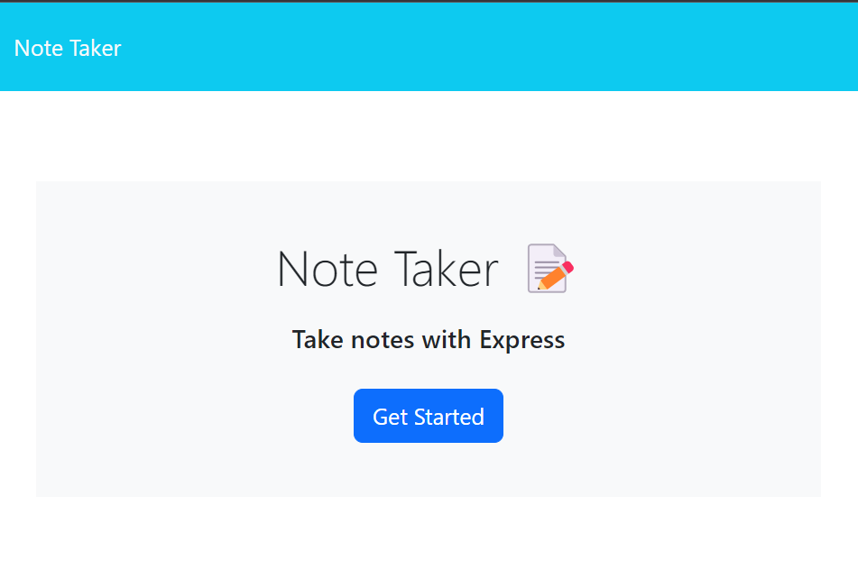
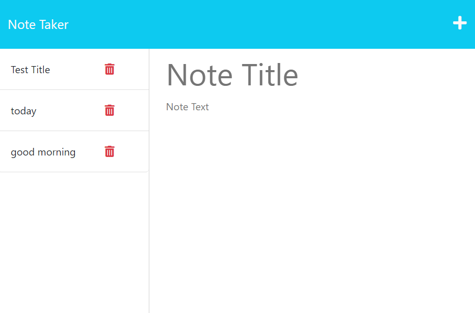
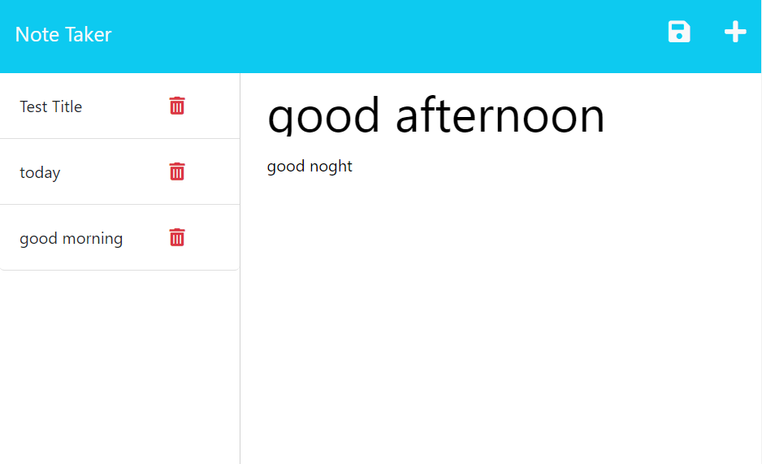
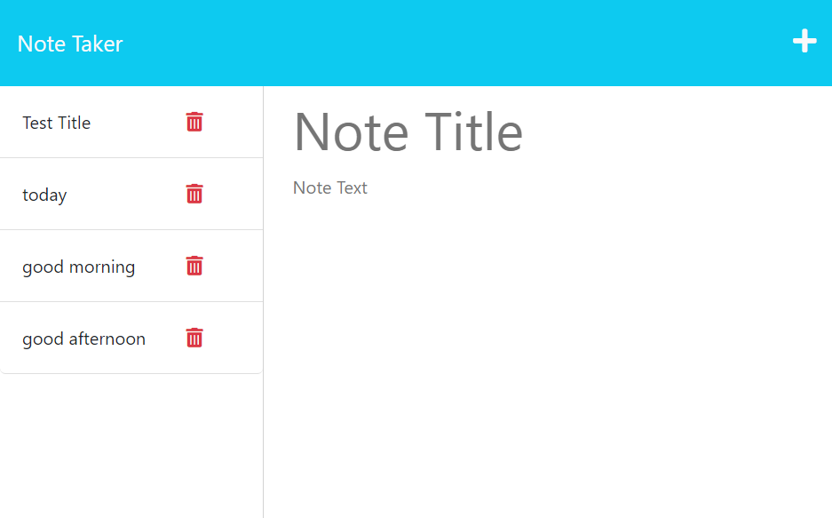

# 11 Express.js: Note Taker

## Description
In this task, I create an application called Note Taker that can be used to write and save notes. This application will use an Express.js back end and will save and retrieve note data from a JSON file.

I can create a new note and store it in the note list, and I can click the note in the note list, and then the note content will show up. 

## Screenshots

## Links

* The URL of the functional, deployed application:
https://dry-bastion-49191-78ddb1a64d95.herokuapp.com/

* The URL of the GitHub repository:
https://github.com/Jiasisi/Note-Taker-Express.js-

